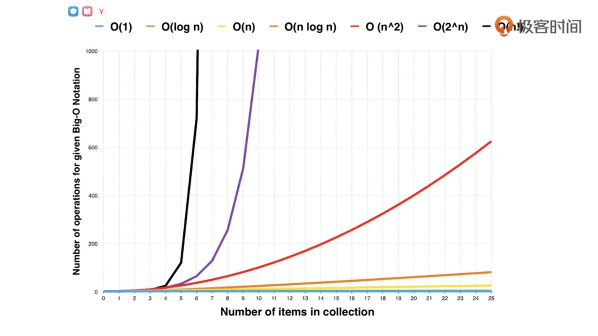

### 时间复杂度

- O(1)
- O(logn)
- O(n)
- O(n^2)
- O(n^3)
- O(2^n)
- O(n!)

注：在多个算法在一起，计算复杂度时只看复杂度最高的。

此处插入一张 “复杂度 - 计算量” 的图，可以看到不同的时间复杂度，随着输入规模增大，计算量呈现出了极大的差别，尤其**在高并发、大量数据的情况下，收益非常可观，因此好的算法有非常高的价值。**




#### 差的算法的时间度复杂度

Fibonacci array: F(n) = F(n-1) + F(n-2)

```
def fib(n) {
	if n == 0 or n == 1:
		return n;
	return fib(n - 1) + fib(n - 2);
}
```

执行一次函数算1次运算，那么可以看到如下这张图中，一个节点分叉出两个节点，最后的时间复杂度是近似 O(2^n)。

因此可以得出结论是，代码虽然只有几行，但是时间复杂度很低；相比较而言，我们直接用一个数组结构，将最后两项累加得到第三项，时间复杂度是O(n)。

#### 常见递归算法的时间复杂度

[https://en.wikipedia.org/wiki/Master_theorem_(analysis_of_algorithms)](https://en.wikipedia.org/wiki/Master_theorem_(analysis_of_algorithms))

|算法|时间复杂度|
|---|---|
|Binary search|O(logn)|
|Binary tree travesal|O(n)|
|Optimal sorted matrix search|O(n)|
|Merge sort|O(nlogn)|

### 空间复杂度

### 参考资料

- 算法面试通关40讲 [[1]](1) 